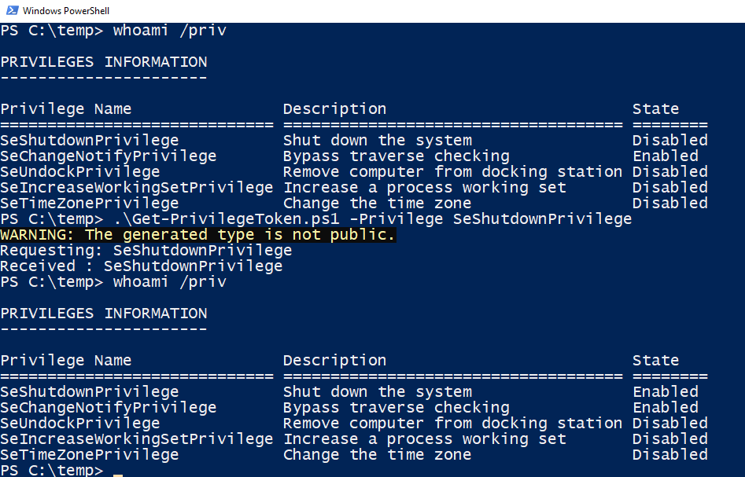

# getprivileges

- C# Sample code to retrieve more privileges
- Powershell script to get more privileges for the current shell.

# C-Sharp

Press a key and get more privileges.

```
PS > .\GetPriv.exe
Press a key to get more privilege ...
.
Requesting: SeAssignPrimaryTokenPrivilege
Received : SeAssignPrimaryTokenPrivilege
Press a key to get more privilege ...
.
Requesting: SeAuditPrivilege
Received : SeAuditPrivilege
Press a key to get more privilege ...
.
Requesting: SeBackupPrivilege
Received : SeBackupPrivilege
Press a key to get more privilege ...
...
```

## Powershell 

C-sharp program doesn't elevate the shell it is being called from. You can use
the Powershell script for that.


